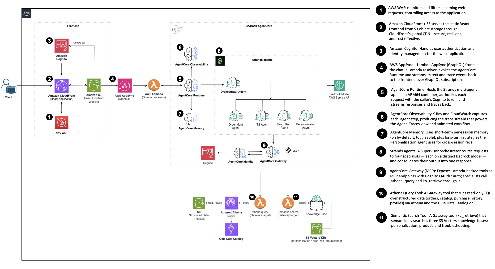
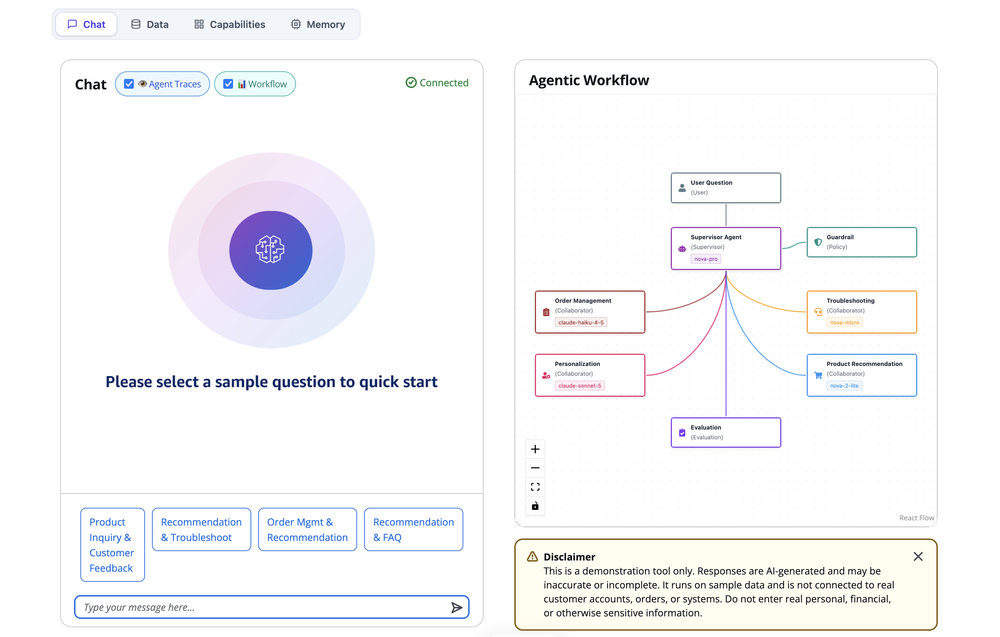

# Multi-Agent Customer Support Assistant

A demo of multi-agent orchestration built with the [Strands Agents SDK](https://strandsagents.com/) on [Amazon Bedrock AgentCore](https://docs.aws.amazon.com/bedrock-agentcore/latest/devguide/what-is-bedrock-agentcore.html).

A Supervisor agent routes a customer's question to four specialists — order management, product recommendation, troubleshooting, and personalization — and consolidates their work into one answer. The specialists reach data through MCP tools on an AgentCore Gateway: `athena_query` generates SQL from natural language against Amazon Athena, and `kb_retrieve` runs semantic search over Amazon S3 Vectors knowledge bases.

The frontend is a React app on Amazon CloudFront, fronted by AWS AppSync and authenticated with Amazon Cognito. It streams the answer as it is generated and animates each agent hop live from AgentCore Observability traces.



## How it works

A request flows: CloudFront → AppSync → a Lambda resolver → the AgentCore Runtime. The resolver invokes the Runtime over HTTPS with the signed-in user's Cognito token and streams text and trace events back over GraphQL subscriptions.

Each agent runs on its own Bedrock model, so the demo shows a multi-model system rather than one model doing everything:

| Agent | Model | Tools |
| --- | --- | --- |
| Supervisor (orchestrator) | Amazon Nova Pro | routes to specialists |
| Personalization | Anthropic Claude Sonnet 5 | `athena_query`, `kb_retrieve` |
| Order Management | Anthropic Claude Haiku 4.5 | `athena_query` |
| Product Recommendation | Amazon Nova 2 Lite | `athena_query`, `kb_retrieve` |
| Troubleshooting | Amazon Nova Micro | `kb_retrieve` |

AgentCore Memory gives short-term per-session recall (toggleable in the UI) plus long-term strategies the Personalization agent uses across sessions. Model IDs live in [`runtime/config.py`](src/backend/lib/stacks/backend/agentcore/runtime/config.py).

## Prerequisites

- **Node.js 22**
- **Python 3** with **[uv](https://docs.astral.sh/uv/)** (recommended) or `pip`. This is only used to download the Linux arm64 wheels for the agent and Lambda bundles; the wheels are resolved for Python 3.12 regardless of your local interpreter version, and nothing is compiled locally.
- **AWS CLI**, plus credentials for the account you are deploying into — either a
  named profile (any name) or keys exported in your shell. You choose between them
  in [step 1](#1-point-the-tooling-at-your-account). To create a profile:

  ```bash
  aws configure --profile mac-demo-dev        # or: aws configure sso --profile mac-demo-dev
  ```

- **Bedrock model access.** Access to Amazon Bedrock foundation models is [enabled by default](https://docs.aws.amazon.com/bedrock/latest/userguide/model-access.html) in commercial Regions — there is no longer a per-model page to click through. Two things still matter:
  - The invoking role needs the AWS Marketplace permissions (`aws-marketplace:Subscribe`, `Unsubscribe`, `ViewSubscriptions`) that let Bedrock complete the subscription on first use, and the account needs a valid payment method.
  - Anthropic asks for first-time-use details once per account (or once at the AWS Organizations management account) before its models can be invoked. This demo uses two Anthropic models, so submit the form by opening any Anthropic model in the Bedrock console model catalog. Access is granted immediately.

  On the very first invocation of a third-party model, Bedrock finalizes the subscription in the background and may briefly return `AccessDeniedException`.

No Docker required. The agent runs on AgentCore's managed Python runtime via direct code deployment, and Lambda dependencies are cross-installed as arm64 wheels, so nothing is built in a container locally.

### New or restricted accounts

Two account settings can block a first deploy:

- **Low Lambda memory ceiling.** Some new accounts cap Lambda `MemorySize` (for
  example at 512 MB), which fails a few functions with `MemorySize value failed to
  satisfy constraint`. Set `MAC_DEMO_MAX_LAMBDA_MEMORY=512` (or your account's cap)
  before deploying — it clamps every Lambda to that ceiling. Leave it unset on
  normal accounts to keep the default sizes.
- **AgentCore Observability tracing.** The Runtime ships traces to CloudWatch via
  X-Ray, which needs CloudWatch Logs enabled as the trace segment destination
  ("Transaction Search"). If the `TracesDelivery` resource fails with "enable the
  CloudWatch Logs destination", enable it once per account/Region:
  `aws xray update-trace-segment-destination --destination CloudWatchLogs`
  (it also needs a CloudWatch Logs resource policy letting `xray.amazonaws.com`
  write to the `aws/spans` log group), wait for it to become `ACTIVE`, then redeploy.

## Deploy

### 1. Point the tooling at your account

Do this in the shell you are about to deploy from.

**Recommended — write a named profile, then point the tooling at it**

Create the profile by pasting the credential **values** (not `$VARIABLES` — an
unset variable silently writes a blank key, which then fails with
`InvalidClientTokenId`):

```bash
aws configure set aws_access_key_id     'YOUR_ACCESS_KEY_ID'     --profile mac-demo-burner
aws configure set aws_secret_access_key 'YOUR_SECRET_ACCESS_KEY' --profile mac-demo-burner
aws configure set aws_session_token     'YOUR_SESSION_TOKEN'     --profile mac-demo-burner   # only for temporary (ASIA) keys
aws configure set region us-east-1 --profile mac-demo-burner

# confirm this prints your account id
aws sts get-caller-identity --profile mac-demo-burner --query Account --output text
```

Then point the tooling at that profile:

```bash
export MAC_DEMO_PROFILE=mac-demo-burner
export MAC_DEMO_ACCOUNT=111122223333        # must match the account printed above
export MAC_DEMO_REGION=us-east-1
```

The profile name is arbitrary; `MAC_DEMO_PROFILE` selects it. A profile persists
across terminals, so you only write it once.

**Alternative — credentials exported in the shell** (short-lived keys)

```bash
unset MAC_DEMO_PROFILE                      # important: a set profile wins over these
export AWS_ACCESS_KEY_ID=...
export AWS_SECRET_ACCESS_KEY=...
export AWS_SESSION_TOKEN=...                # required for temporary (ASIA) keys
export MAC_DEMO_ACCOUNT=111122223333
export MAC_DEMO_REGION=us-east-1

aws sts get-caller-identity --query Account --output text
```

Exported credentials are detected automatically and the `--profile` flag is
dropped; `export MAC_DEMO_PROFILE=none` forces this mode if a profile is still set.

> **`AKIA` vs `ASIA`.** A key starting with `AKIA` is a long-term IAM key and needs
> no session token. A key starting with `ASIA` is temporary (Isengard,
> `aws sts get-session-token`, assumed roles) and **requires** `aws_session_token`;
> without it every call fails with `InvalidClientTokenId`. Copy all three values
> from the same source.

If the account printed above differs from `MAC_DEMO_ACCOUNT`, fix one of them
before continuing — the CLI refuses to deploy on a mismatch and names the two
values that disagree.

These exports only live in the current shell, so re-run them in a new terminal.
You can instead put `number`, `region`, and an optional `profile` per stage in
[`config/project-config.json`](config/project-config.json), though the environment
variables are preferable when the repository is shared, so an account id never
lands in a commit.

### 2. Install and deploy

```bash
npm install
npm run configure     # verifies credentials and bootstraps CDK
npm run develop       # interactive deployment CLI
```

In the CLI, choose **Deploy CDK Stack(s) 🚀**, then **Deploy Frontend 🖥️**.

If credentials are wrong, **Verify Credentials 🔑** reports what it found: an
unresolvable profile lists the profiles available on your machine, and a mismatch
prints both account ids alongside the export needed to correct it.

### 3. Create your first user

Open the CloudFront URL printed by the deployment and choose **Create Account** on
the login page. Register with an email and password, confirm the code Cognito
emails you, and sign in — a post-confirmation Lambda seeds that user's own sample
data on first sign-in. Passwords need 8+ characters with upper, lower, digit, and
symbol.

> Self-service sign-up means anyone who can reach the site can register and run
> the demo, which invokes Bedrock on their behalf (a cost). It sits behind the WAF
> WebACL; to lock it down, set `selfSignUpEnabled: false` in
> [`auth.ts`](src/backend/lib/stacks/backend/auth.ts) and create users yourself.

An administrator can also create users directly — `npm run develop` →
**Manage Cognito Users 👤** (prompts for an email, sends a temporary password), or:

```bash
aws cognito-idp admin-create-user \
  --user-pool-id <USER_POOL_ID> \
  --username you@example.com \
  --user-attributes Name=email,Value=you@example.com Name=email_verified,Value=true \
  --profile mac-demo-dev
```

See [docs/kit/cognito-user-creation.md](docs/kit/cognito-user-creation.md) for the console walkthrough.



## Run the frontend locally

`npm run develop` → **Refresh Local Environment 📦**, then **Test Frontend Locally 💻**. The app serves on <http://localhost:3000>.

The frontend gets all of its configuration from `VITE_*` build-time variables, chiefly `VITE_RUNTIME_CONFIG` — a JSON blob holding the Runtime ARN, Gateway URL, Memory ID, the five agent node IDs, and each agent's profile. The stack exports it to the frontend build; the app fails fast on startup if it is missing.

## Cost

As of July 2026, running this in us-east-1 with default settings costs roughly **$345/month** for 100,000 requests averaging 700K input/output tokens. AgentCore and Bedrock inference are consumption-based, so treat those as estimates and check the [AWS Pricing Calculator](https://calculator.aws/) for your own usage.

| Service | Cost [USD/mo] |
| --- | --- |
| Amazon Bedrock (model inference, multi-model mix) | $120.00 |
| AWS AppSync (queries + subscriptions) | $75.30 |
| Amazon Bedrock AgentCore Runtime | $45.00 |
| Amazon Cognito (500 MAU, advanced security) | $25.00 |
| Amazon Bedrock AgentCore Memory | $18.00 |
| Amazon Athena (1 GB/query, 100 queries/day) | $14.85 |
| AWS WAF | $14.00 |
| Amazon Bedrock AgentCore Gateway | $12.00 |
| Amazon Bedrock AgentCore Observability | $10.00 |
| Amazon S3 Vectors (three knowledge bases) | $6.00 |
| Amazon DynamoDB | $3.15 |
| AWS Glue Data Catalog | $1.00 |
| Amazon CloudFront | $0.63 |
| Amazon S3 | $0.24 |
| AWS Lambda | $0.00 |
| **Total** | **~$345** |

## Security

This is demonstration code. Review it against your own requirements before adapting it — notably, self-service sign-up is enabled (anyone who can reach the site can register and incur Bedrock cost), MFA is not enforced on the Cognito user pool, and the Gateway's machine-to-machine client secret is passed to the Runtime as an environment variable.

To report a security issue, use the [AWS vulnerability reporting page](https://aws.amazon.com/security/vulnerability-reporting/) rather than a public GitHub issue.

## License

Apache 2.0. See [LICENSE](LICENSE) and [CODE_OF_CONDUCT.md](CODE_OF_CONDUCT.md).
